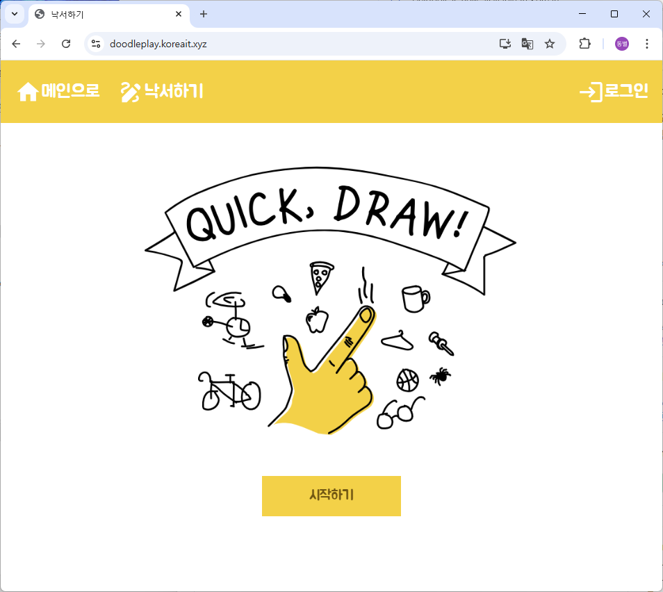
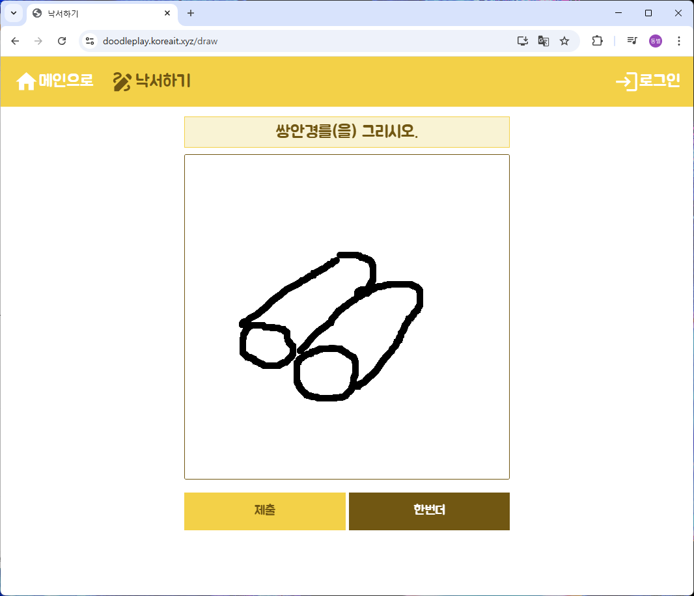
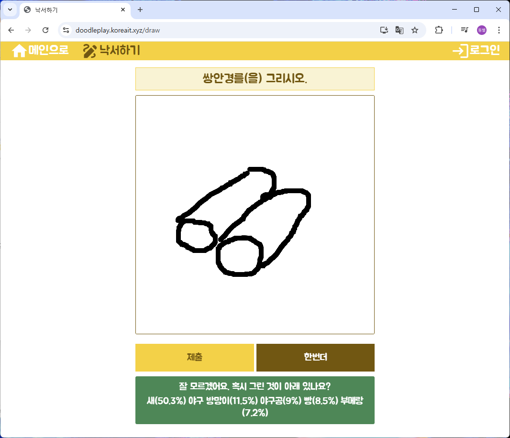

# `quick_draw_fe`
React 기반 프론트엔드로, 사용자 드로잉을 백엔드에 전송해 예측 결과를 시각화합니다.

## 주요 기능
### 1. 로그인 페이지
- **`LoginPage`**
  - **`LoginForm`**: 사용자 인증을 위한 로그인 폼
  - **`LoginContainer`**: 로그인 페이지의 컨테이너

### 2. 메인 페이지
- **`MainPage`**: 간단한 소개 및 네비게이션

### 3. 드로잉 페이지
- **`DrawPage`**
  - **`Canvas.js`**: HTML5 Canvas를 사용한 드로잉 기능
  - **`Direction.js`**: 드로잉 가이드를 제공하는 컴포넌트
  - **`Result.js`**: 예측 결과를 리스트 형식으로 표시

### 4. 전역 레이아웃
- **`MainLayout`**
  - **`Header`**: 상단 내비게이션 바
  - **`Footer`**: 하단 정보 및 링크

### 5. 컨텍스트 및 훅
- **`CommonContext`**: 전역 상태 관리를 위한 컨텍스트
- **`useUserInfo`**: 사용자 정보를 가져오는 커스텀 훅
- **`useLogout`**: 로그아웃 기능을 위한 커스텀 훅

### 6. 스타일링
- **Tailwind CSS**: 유틸리티 기반 CSS 프레임워크
- **Custom Color / Font Size**: 맞춤형 색상 및 폰트 크기 설정

---
## 설치 & 실행

```bash
cd quick_draw_fe
npm install
npm run dev       # http://localhost:3000
````

## 환경 변수 (`.env`)

```env
VITE_API_BASE_URL=http://localhost:3001
VITE_PORT=3000
```

## 디렉터리 구조

```
quick_draw_fe/
├─ .env
├─ package.json
├─ public/                # index.html, favicon, manifest 등
└─ src/
   ├ App.js
   ├ index.js
   ├ drawing/
   │  ├ components/       # Canvas.js, Direction.js, Result.js
   │  └ containers/       # DrawContainer.js
   ├ main/pages/          # MainPage.js
   ├ member/              # LoginPage.js, LoginForm.js, LoginContainer.js
   ├ global/
   │  ├ layouts/          # MainLayout.js
   │  ├ outlines/         # Header.js, Footer.js
   │  ├ contexts/         # CommonContext.js
   │  ├ hooks/            # useUserInfo.js, useLogout.js
   │  ├ styles/           # color.js, fontsize.js
   │  └ images/           # loading.gif, main.png
   └ setupTests.js
```

## 배포 가이드 (NGINX + SSL)

```bash
# 1. 빌드
npm run build
```
<!--
# 2. 정적 파일 배포
sudo cp -r dist/* /var/www/html/

# 3. Nginx 설정(/etc/nginx/sites-available/default)
#    root /var/www/html;
sudo systemctl restart nginx

# 4. SSL 인증서 발급
sudo certbot --nginx -d doodleplay.koreait.xyz
-->

## 구현 화면
### 메인 화면


### 로그인 화면


### 그림판 화면


### 예측 결과

