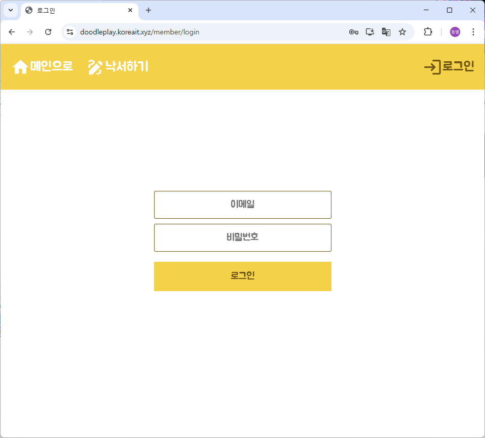

# `quick_draw_fe`
React 기반 프론트엔드로, 사용자 드로잉을 백엔드에 전송해 예측 결과를 시각화합니다.

## 주요 기능
- **드로잉 캔버스**: 마우스(또는 터치)로 자유롭게 그릴 수 있는 캔버스 컴포넌트  
- **예측 요청**: “Predict” 버튼 클릭 시 캔버스 이미지를 Base64로 변환해 `/predict` API 호출  
- **결과 표시**: 상위 5개 분류 라벨과 확률을 리스트로 렌더링  
- **에러 & 로딩 핸들링**: 요청 중 로딩 스피너 표시, 실패 시 사용자 알림

## 설치 & 실행

```bash
cd quick_draw_fe
npm install
npm run dev       # http://localhost:3000
````

## 환경 변수 (`.env`)

```env
VITE_API_BASE_URL=http://localhost:3001
VITE_PORT=3000
```

## 디렉터리 구조

```
quick_draw_fe/
├─ .env
├─ package.json
├─ public/                # index.html, favicon, manifest 등
└─ src/
   ├ App.js
   ├ index.js
   ├ drawing/
   │  ├ components/       # Canvas.js, Direction.js, Result.js
   │  └ containers/       # DrawContainer.js
   ├ main/pages/          # MainPage.js
   ├ member/              # LoginPage.js, LoginForm.js, LoginContainer.js
   ├ global/
   │  ├ layouts/          # MainLayout.js
   │  ├ outlines/         # Header.js, Footer.js
   │  ├ contexts/         # CommonContext.js
   │  ├ hooks/            # useUserInfo.js, useLogout.js
   │  ├ styles/           # color.js, fontsize.js
   │  └ images/           # loading.gif, main.png
   └ setupTests.js
```

## 배포 가이드 (NGINX + SSL)

```bash
# 1. 빌드
npm run build
```
<!--
# 2. 정적 파일 배포
sudo cp -r dist/* /var/www/html/

# 3. Nginx 설정(/etc/nginx/sites-available/default)
#    root /var/www/html;
sudo systemctl restart nginx

# 4. SSL 인증서 발급
sudo certbot --nginx -d doodleplay.koreait.xyz
-->

## 구현 화면
### 메인 화면


### 로그인 화면


### 그림판 화면


### 예측 결과

